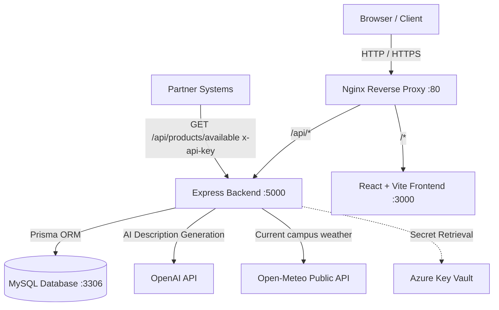

# 🛍️ Smart Store

[](https://www.docker.com/)
[](https://reactjs.org/)
[](https://nodejs.org/)
[](https://www.prisma.io/)
[](https://www.mysql.com/)
[](https://entra.microsoft.com/)
[](https://openai.com/)

**CSX4110 Backend Application Development • Section 541 (1/2026)**  
**Team Members:** Khine Khant (6611718), Siva Paoren (6630064), Thant Zin Oo (6722060)

---

## 📖 1. Project Overview

The **Smart University Merchandise Store** is a modern, web-based e-commerce platform allowing university staff and students to purchase and manage official university merchandise securely.

### Key Capabilities:
1. **Microsoft Entra ID (Azure AD) Authentication & RBAC**: Role-based access control for **Students**, **Staff**, and **Administrators**.
2. **AI Product Description Generation**: Integrated with **OpenAI GPT-4** to automatically write professional merchandise descriptions.
3. **Public & Partner API Integration**:
   - **Consuming Public API**: Uses the **Open-Meteo Weather API** to show live campus weather and recommend suitable in-stock merchandise.
   - **Exposing Partner API**: Exposes `GET /api/products/available` protected with `x-api-key` for partner university services.
4. **Cloud & Container Ready**: Automated containerization with **Docker Compose**, **Nginx Reverse Proxy**, and **Azure Key Vault** secret management.

---

## 🏗️ 2. System Architecture



---

## 📁 3. Directory Structure

```text
university-merchandise-store/
├── docker-compose.yml          # Multi-container orchestration (MySQL, Backend, Frontend, Nginx)
├── nginx.conf                  # Nginx reverse proxy configuration
├── .env.example                # Unified environment variable template
├── README.md                   # Project documentation
├── docs/                       # Project documentation & reference guides
│   └── API.md                  # Detailed Backend REST API specifications & schemas
│
├── backend/                    # Node.js + Express + TypeScript + Prisma
│   ├── prisma/
│   │   ├── schema.prisma       # Database schema definition (ERD)
│   │   └── seed.ts             # Default roles, users, categories & sample products
│   ├── src/
│   │   ├── config/             # DB & Azure Key Vault configuration
│   │   ├── controllers/        # Auth, Product, Cart, Order, User, Weather controllers
│   │   ├── middlewares/        # JWT auth, RBAC, API Key check, Error handler
│   │   ├── routes/             # Express API routing
│   │   ├── services/           # OpenAI AI service & Open-Meteo client
│   │   ├── app.ts              # Express application configuration
│   │   └── server.ts           # Server bootstrap
│   ├── Dockerfile
│   ├── package.json
│   └── tsconfig.json
│
└── frontend/                   # React + TypeScript + Vite
    ├── src/
    │   ├── components/         # Navbar, ProductCard, CartDrawer
    │   ├── contexts/           # AuthContext (Entra ID / Dev Switcher), CartContext
    │   ├── pages/              # HomePage, ProductDetailPage, OrdersPage, AdminDashboard, LoginPage
    │   ├── services/           # Axios API client
    │   ├── types/              # TypeScript data interfaces
    │   ├── App.tsx             # Root application
    │   ├── index.css           # Modern design system & responsive styling
    │   └── main.tsx
    ├── Dockerfile
    ├── package.json
    └── vite.config.ts
```

---

## 🚀 4. Quickstart with Docker Compose (Recommended)

### Step 1: Clone and Configure Environment

```bash
cp .env.example .env
```

### Step 2: Build & Start All Containers

```bash
docker compose up --build
```

Docker Compose will start:
- 🌐 **Frontend (Nginx / Web)**: [http://localhost](http://localhost) (or [http://localhost:3000](http://localhost:3000))
- ⚡ **Backend API**: [http://localhost:5000/api](http://localhost:5000/api)
- 🗄️ **MySQL Database**: `localhost:3306`

> **Note:** The backend automatically applies the Prisma schema on container startup. In production it bootstraps only the required Admin, Staff, and Student roles, then runs the compiled server. Demo users/products and the development watcher run only when `NODE_ENV` is not `production`.

---

## 💻 5. Local Development (Without Docker)

### Prerequisites:
- Node.js >= 22.x
- MySQL 8.0 running locally

### 1. Setup Backend

```bash
cd backend
cp .env.example .env
npm install

# Initialize Prisma & Seed Database
npx prisma db push
npx prisma db seed

# Run Backend Dev Server
npm run dev
```

### 2. Setup Frontend

```bash
cd frontend
cp .env.example .env
npm install

# Run Vite Dev Server
npm run dev
```

---

## 👥 6. Pre-Configured Seed Users & Roles

The seed script creates default test accounts with instant role switching available via the UI navigation dropdown:

| Role | Name | Email | Department | Permissions |
| :--- | :--- | :--- | :--- | :--- |
| **Admin** | System Admin | `admin@university.edu` | IT Services | Full control: Users, Roles, Products, Orders, Reports |
| **Staff** | Store Staff Member | `staff@university.edu` | Bookstore & Merch | Create/Edit/Delete products, AI copy generation, Order status update |
| **Student** | Khine Khant | `khine.k@university.edu` | Computer Science | Browse merchandise, Add to cart, 20% CS jacket discount, View orders |
| **Student** | Siva Paoren | `siva.p@university.edu` | Computer Science | Browse merchandise, CS discount eligible |
| **Student** | Thant Zin Oo | `thant.z@university.edu` | Business Admin | Browse merchandise, standard student ordering |

### Configuring Real Microsoft Entra ID Login

The login flow uses MSAL (Authorization Code + PKCE) on the frontend and verifies the returned
ID token on the backend (signature via the tenant JWKS, issuer, audience, expiry). Until an
app registration is configured, the store runs in **dev fallback mode** (unverified profile
login + role switcher); once configured, only verified Entra ID tokens are accepted and the dev role switcher is disabled.

1. In [Microsoft Entra admin center](https://entra.microsoft.com), register an app:
   - **Platform**: Single-page application (SPA)
   - **Redirect URIs**: `http://localhost:5173` (Vite dev), `http://localhost` (Docker/nginx)
   - **Supported account types**: Single tenant (university directory)
   - **API permissions**: `User.Read` (delegated, Microsoft Graph) — no client secret needed for login
2. Fill in `AZURE_TENANT_ID` and `AZURE_CLIENT_ID` in `.env` / `backend/.env` / `frontend/.env`.
3. Set `ADMIN_EMAILS` (comma-separated) — those accounts get the **Admin** role automatically on
   first verified login. Staff/Student roles are managed afterwards via Admin → User Management.
4. Restart the containers (`docker compose up --build`). The login modal now shows **Sign in with Microsoft**.

**How it works:** the frontend opens the Microsoft sign-in popup and posts the resulting ID token
to `POST /api/auth/microsoft`; the backend validates it against the tenant's public keys, upserts
the user, and issues the app's own JWT used by all subsequent API calls.

**New production database:** container startup creates only the three required RBAC roles. Put at
least one university account in `ADMIN_EMAILS` before deployment. That account becomes the initial
administrator on its first Microsoft login; other accounts are created as Students and can then be
promoted to Staff from Admin → User Management.

---

## 🤖 7. AI Product Description Integration

Staff and Administrators can trigger the **OpenAI GPT-4** integration when creating or updating products:

An administrator configures the provider URL, model, and API key under **Admin Dashboard →
Site Settings**. The API key is stored only in the database and is never loaded from an
environment variable or Azure Key Vault.

```http
POST /api/products/ai-description
Authorization: Bearer <STAFF_OR_ADMIN_JWT>
Content-Type: application/json

{
  "productName": "University Varsity Bomber Jacket",
  "categoryName": "Apparel & Clothing",
  "department": "Computer Science"
}
```

**Response:**
```json
{
  "description": "Exclusive Computer Science Department premium bomber jacket with cyber-blue trim, custom embroidered CS patch, and water-resistant outer shell. Designed for campus comfort and academic pride."
}
```

### Bulk Product Import

Staff and administrators can import up to 500 products at once from the **Admin Dashboard → Inventory** page.
The importer accepts `.xlsx` and `.csv` files, provides a downloadable template, previews the parsed rows,
and reports validation errors with their spreadsheet row numbers before anything is saved.

Required columns are `name`, `price`, `stock`, and `category`. Optional columns are `description`,
`imageUrl`, `department`, and `discountPct`. The category value must match an existing category name;
`categoryId` is also accepted. Imports are atomic, so a failed row prevents the entire file from being added.

```http
POST /api/products/bulk
Authorization: Bearer <STAFF_OR_ADMIN_JWT>
Content-Type: application/json

{
  "products": [
    {
      "row": 2,
      "name": "University Classic T-Shirt",
      "price": 450,
      "stock": 40,
      "category": "Apparel & Clothing",
      "discountPct": 0
    }
  ]
}
```

---

## 📡 8. Backend REST API Documentation

The backend provides a RESTful JSON API listening on port `5000` (proxied via Nginx at `/api`). All request bodies and response payloads use JSON unless otherwise specified.

### Base URLs
- **Local Dev**: `http://localhost:5000/api`
- **Docker Compose (via Nginx)**: `http://localhost/api`
- **Production (HTTPS)**: `https://<domain>/api`

### Authentication & Authorization Schemes
- **Public**: No authorization required.
- **JWT Bearer Token**: Pass header `Authorization: Bearer <token>`. Generated upon Microsoft Entra ID or dev login. Tokens encode `userId`, `roleName`, `email`, and `department`.
- **RBAC Roles**: 
  - `Student`: Browse catalog, manage own cart, checkout orders, view own order history.
  - `Staff`: All student actions + create/update/delete products, generate AI descriptions, bulk import, view all orders, update order status.
  - `Admin`: Full permissions including user role assignment, role listing, and AI site settings.
- **Partner API Key**: Header `x-api-key: <key>` validated against `PARTNER_EXPOSED_API_KEY`.

---

### 📋 API Endpoint Summary

| Category | Method | Endpoint | Auth / Role | Description |
| :--- | :--- | :--- | :--- | :--- |
| **System** | `GET` | `/api/health` | Public | API health check and server timestamp |
| **Auth** | `POST` | `/api/auth/microsoft` | Public | Microsoft Entra ID login & JWT token exchange |
| | `POST` | `/api/auth/dev-login` | Public (Dev only) | Instant role switcher for local testing |
| | `GET` | `/api/auth/me` | Bearer Token | Retrieve currently authenticated user profile |
| **Products** | `GET` | `/api/products` | Public | List products (with category, search, department filters) |
| | `GET` | `/api/products/categories` | Public | List product categories with product counts |
| | `GET` | `/api/products/:id` | Public | Get product details by ID |
| | `POST` | `/api/products` | Staff, Admin | Create a new merchandise product |
| | `POST` | `/api/products/ai-description` | Staff, Admin | Generate AI marketing copy using OpenAI GPT |
| | `POST` | `/api/products/bulk` | Staff, Admin | Atomic bulk import (up to 500 products) |
| | `PUT` | `/api/products/:id` | Staff, Admin | Update product details |
| | `DELETE` | `/api/products/:id` | Staff, Admin | Delete a merchandise product |
| **Cart** | `GET` | `/api/cart` | Bearer Token | Get active cart items, item count, and subtotal |
| | `POST` | `/api/cart/add` | Bearer Token | Add product to cart or increment quantity |
| | `PUT` | `/api/cart/items/:itemId` | Bearer Token | Update cart item quantity (0 removes item) |
| | `DELETE` | `/api/cart/items/:itemId` | Bearer Token | Remove specific item from cart |
| | `DELETE` | `/api/cart/clear` | Bearer Token | Clear all items from user cart |
| **Orders** | `POST` | `/api/orders/checkout` | Bearer Token | Checkout cart with department discount & deduct stock |
| | `GET` | `/api/orders/my-orders` | Bearer Token | Get order history of logged-in user |
| | `GET` | `/api/orders` | Staff, Admin | Get all orders in store with revenue analytics |
| | `PUT` | `/api/orders/:id/status` | Staff, Admin | Update order status (`PENDING`, `PROCESSING`, `COMPLETED`, `CANCELLED`) |
| **Users** | `GET` | `/api/users` | Admin | List all registered users with role & order count |
| | `GET` | `/api/users/roles` | Admin | List all system RBAC roles |
| | `PUT` | `/api/users/:id` | Admin | Update user role or department |
| **Settings** | `GET` | `/api/settings` | Admin | Get current AI configuration (masked API key) |
| | `PUT` | `/api/settings` | Admin | Update AI endpoint URL, model, or API key |
| **Weather** | `GET` | `/api/weather/recommendations` | Public | Campus weather & smart apparel recommendations (Open-Meteo) |
| **Partner API** | `GET` | `/api/products/available` | `x-api-key` | In-stock product feed for partner university systems |

---

### 📖 Detailed Endpoint Reference

> 💡 **Full API Reference**: All endpoint request bodies, query parameters, complete JSON schemas, and error responses are documented in the dedicated **[Backend REST API Reference (docs/API.md)](docs/API.md)**.

#### Highlighted API Integrations:

##### A. Consuming Public API (Open-Meteo Campus Weather)
The backend requests live campus weather from the external **Open-Meteo Public API** and evaluates temperature, precipitation, and WMO codes to recommend relevant in-stock apparel.
- **Store Endpoint**: `GET http://localhost:5000/api/weather/recommendations`
- **External Public API**: `GET https://api.open-meteo.com/v1/forecast`
- **Authentication**: None required (Public)
- **Caching**: 10 minutes in-memory cache to respect public API rate limits.
- *Detailed schema: [Weather Recommendations in docs/API.md](docs/API.md#8-campus-weather-recommendations-consuming-public-api)*

##### B. Exposed Partner API (`GET /api/products/available`)
Partner university systems can query live store inventory with department-specific pricing and stock levels.
- **Store Endpoint**: `GET http://localhost:5000/api/products/available`
- **Header**: `x-api-key: partner_incoming_api_key_98765` (configurable via `PARTNER_EXPOSED_API_KEY`)
- *Detailed schema: [Partner System API in docs/API.md](docs/API.md#9-partner--peer-university-system-api-exposing-protected-api)*

##### C. Complete Documentation Link
For the complete catalog of all 20+ endpoints (Authentication, Products, Cart, Orders, Admin Users, Site Settings, Error handling):
👉 **[Read the Full Backend API Documentation (docs/API.md)](docs/API.md)**

---

## ☁️ 9. Azure Cloud Deployment Guide

### Azure Key Vault setup

The backend uses `DefaultAzureCredential` with the service-principal values supplied for
the class project. That identity only needs permission to read secrets.

1. Create a resource group and RBAC-enabled vault (replace the example values):

   ```bash
   az group create --name merch-store-rg --location southeastasia
   az keyvault create \
     --name <globally-unique-vault-name> \
     --resource-group merch-store-rg \
     --location southeastasia \
     --enable-rbac-authorization true
   ```

2. Add the application secrets. Key Vault secret names use hyphens because Azure secret
   names cannot contain underscores:

   ```bash
   az keyvault secret set --vault-name <vault-name> --name JWT-SECRET --value '<at-least-32-random-characters>'
   az keyvault secret set --vault-name <vault-name> --name PARTNER-EXPOSED-API-KEY --value '<incoming-partner-api-key>'
   ```

   | Key Vault secret | Backend setting |
   | :--- | :--- |
   | `JWT-SECRET` | `JWT_SECRET` |
   | `PARTNER-EXPOSED-API-KEY` | `PARTNER_EXPOSED_API_KEY` |

3. Give the service principal the **Key Vault Secrets User** role at the vault scope if
   it has not already been granted access:

   ```bash
   az role assignment create \
     --assignee <AZURE_CLIENT_ID> \
     --role "Key Vault Secrets User" \
     --scope <key-vault-resource-id>
   ```

4. Configure the backend with the four supplied values:

   ```dotenv
   AZURE_TENANT_ID=<tenant-id>
   AZURE_CLIENT_ID=<service-principal-client-id>
   AZURE_CLIENT_SECRET=<service-principal-secret>
   KEY_VAULT_URL=https://<vault-name>.vault.azure.net
   ```

At startup, values found in Key Vault override local environment values. Missing optional
vault entries keep their environment fallbacks. If a configured vault cannot be reached or
authenticated in production, startup stops instead of silently using fallback credentials.

### Deploy on an Azure VM

1. **Provision an Azure Linux VM**.
2. **Install Docker Engine and the Docker Compose plugin** by following Docker's
   [Ubuntu installation guide](https://docs.docker.com/engine/install/ubuntu/). Compose
   v2.24 or newer is required by the production overlay.
3. **Clone the application**:
   ```bash
   git clone <REPO_URL>
   cd university-merchandise-store
   cp .env.example .env
   ```
4. **Configure production environment values**. In particular, set the public HTTPS
   origins used by CORS and Microsoft Entra ID:

   ```dotenv
   NODE_ENV=production
   CORS_ORIGINS=https://store.example.edu
   VITE_AZURE_REDIRECT_URI=https://store.example.edu
   ```

   Add the same HTTPS redirect URI to the Microsoft Entra app registration. Point the
   domain's DNS record to the VM and allow inbound TCP ports 80 and 443 in its network
   security group.

5. **Configure HTTPS and start production**. Install Certbot directly on the VM and
   obtain a certificate for the public hostname before starting the containers. Update
   the certificate paths in `nginx.prod.conf` if the hostname differs from the configured
   value, then start the production stack:

   ```bash
   sudo certbot certificates
   sudo certbot renew --dry-run
   docker compose -f docker-compose.yml -f docker-compose.prod.yml up -d --build
   ```

   The production overlay keeps MySQL, the backend, and the frontend off public host
   ports. The VM's Certbot installation manages renewal, while Nginx periodically reloads
   to pick up renewed certificate files mounted read-only from `/etc/letsencrypt`. Port 80
   redirects normal requests to HTTPS.

   Local development is unchanged and does not run Certbot:

   ```bash
   docker compose up --build
   ```

Azure's JavaScript guidance recommends managed identity in hosted environments and
`DefaultAzureCredential` for a consistent development/production authentication flow. See
the [Azure Key Vault JavaScript quickstart](https://learn.microsoft.com/en-us/azure/key-vault/secrets/quick-create-node)
and [Azure Identity authentication guidance](https://learn.microsoft.com/en-us/azure/developer/javascript/sdk/authentication/best-practices).
