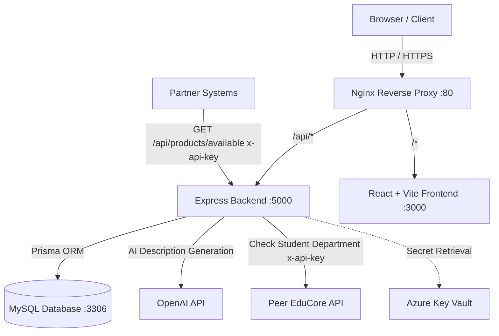

# 🛍️ Smart University Merchandise Store

[](https://www.docker.com/)
[](https://reactjs.org/)
[](https://nodejs.org/)
[](https://www.prisma.io/)
[](https://www.mysql.com/)
[](https://entra.microsoft.com/)
[](https://openai.com/)

**CSX4110 Backend Application Development • Section 541 (1/2026)**  
**Team Members:** Khine Khant (6611718), Siva Paoren (6630064), Thant Zin Oo (6722060)

---

## 📖 1. Project Overview

The **Smart University Merchandise Store** is a modern, web-based e-commerce platform allowing university staff and students to purchase and manage official university merchandise securely.

### Key Capabilities:
1. **Microsoft Entra ID (Azure AD) Authentication & RBAC**: Role-based access control for **Students**, **Staff**, and **Administrators**.
2. **AI Product Description Generation**: Integrated with **OpenAI GPT-4** to automatically write professional merchandise descriptions.
3. **Peer API Integration**:
   - **Consuming Peer API**: Communicates with the partner team's **EduCore Course Registration API** (`GET /students/{studentId}/department`) to verify student department enrollment for student discounts.
   - **Exposing Partner API**: Exposes `GET /api/products/available` protected with `x-api-key` for partner university services.
4. **Cloud & Container Ready**: Automated containerization with **Docker Compose**, **Nginx Reverse Proxy**, and **Azure Key Vault** secret management.

---

## 🏗️ 2. System Architecture



---

## 📁 3. Directory Structure

```text
university-merchandise-store/
├── docker-compose.yml          # Multi-container orchestration (MySQL, Backend, Frontend, Nginx)
├── nginx.conf                  # Nginx reverse proxy configuration
├── .env.example                # Unified environment variable template
├── README.md                   # Project documentation
│
├── backend/                    # Node.js + Express + TypeScript + Prisma
│   ├── prisma/
│   │   ├── schema.prisma       # Database schema definition (ERD)
│   │   └── seed.ts             # Default roles, users, categories & sample products
│   ├── src/
│   │   ├── config/             # DB & Azure Key Vault configuration
│   │   ├── controllers/        # Auth, Product, Cart, Order, User, Peer controllers
│   │   ├── middlewares/        # JWT auth, RBAC, API Key check, Error handler
│   │   ├── routes/             # Express API routing
│   │   ├── services/           # OpenAI AI service & EduCore Peer API client
│   │   ├── app.ts              # Express application configuration
│   │   └── server.ts           # Server bootstrap
│   ├── Dockerfile
│   ├── package.json
│   └── tsconfig.json
│
└── frontend/                   # React + TypeScript + Vite
    ├── src/
    │   ├── components/         # Navbar, ProductCard, CartDrawer
    │   ├── contexts/           # AuthContext (Entra ID / Dev Switcher), CartContext
    │   ├── pages/              # HomePage, ProductDetailPage, OrdersPage, AdminDashboard, LoginPage
    │   ├── services/           # Axios API client
    │   ├── types/              # TypeScript data interfaces
    │   ├── App.tsx             # Root application
    │   ├── index.css           # Modern design system & responsive styling
    │   └── main.tsx
    ├── Dockerfile
    ├── package.json
    └── vite.config.ts
```

---

## 🚀 4. Quickstart with Docker Compose (Recommended)

### Step 1: Clone and Configure Environment

```bash
cp .env.example .env
```

### Step 2: Build & Start All Containers

```bash
docker compose up --build
```

Docker Compose will start:
- 🌐 **Frontend (Nginx / Web)**: [http://localhost](http://localhost) (or [http://localhost:3000](http://localhost:3000))
- ⚡ **Backend API**: [http://localhost:5000/api](http://localhost:5000/api)
- 🗄️ **MySQL Database**: `localhost:3306`

> **Note:** The backend automatically applies migrations (`prisma db push`) and populates seed data (`prisma db seed`) upon container startup.

---

## 💻 5. Local Development (Without Docker)

### Prerequisites:
- Node.js >= 20.x
- MySQL 8.0 running locally

### 1. Setup Backend

```bash
cd backend
cp .env.example .env
npm install

# Initialize Prisma & Seed Database
npx prisma db push
npx prisma db seed

# Run Backend Dev Server
npm run dev
```

### 2. Setup Frontend

```bash
cd frontend
cp .env.example .env
npm install

# Run Vite Dev Server
npm run dev
```

---

## 👥 6. Pre-Configured Seed Users & Roles

The seed script creates default test accounts with instant role switching available via the UI navigation dropdown:

| Role | Name | Email | Department | Permissions |
| :--- | :--- | :--- | :--- | :--- |
| **Admin** | System Admin | `admin@university.edu` | IT Services | Full control: Users, Roles, Products, Orders, Reports |
| **Staff** | Store Staff Member | `staff@university.edu` | Bookstore & Merch | Create/Edit/Delete products, AI copy generation, Order status update |
| **Student** | Khine Khant | `khine.k@student.university.edu` | Computer Science | Browse merchandise, Add to cart, 20% CS jacket discount, View orders |
| **Student** | Siva Paoren | `siva.p@student.university.edu` | Computer Science | Browse merchandise, CS discount eligible |
| **Student** | Thant Zin Oo | `thant.z@student.university.edu` | Business Admin | Browse merchandise, standard student ordering |

---

## 🤖 7. AI Product Description Integration

Staff and Administrators can trigger the **OpenAI GPT-4** integration when creating or updating products:

```http
POST /api/products/ai-description
Authorization: Bearer <STAFF_OR_ADMIN_JWT>
Content-Type: application/json

{
  "productName": "University Varsity Bomber Jacket",
  "categoryName": "Apparel & Clothing",
  "department": "Computer Science"
}
```

**Response:**
```json
{
  "description": "Exclusive Computer Science Department premium bomber jacket with cyber-blue trim, custom embroidered CS patch, and water-resistant outer shell. Designed for campus comfort and academic pride."
}
```

---

## 🔗 8. Peer API Specifications

### A. Consuming Peer API (EduCore Course Registration)
When a student checks out department-specific merchandise (e.g., Computer Science Jacket), our backend sends a request to the EduCore API:
- **Endpoint**: `GET /students/{studentId}/department`
- **Header**: `x-api-key: <PEER_EDUCORE_API_KEY>`

### B. Exposed Partner API (`GET /api/products/available`)
Partner university systems can query live store stock:
- **Endpoint**: `GET http://localhost:5000/api/products/available`
- **Header**: `x-api-key: partner_incoming_api_key_98765`

**Example Response:**
```json
[
  {
    "id": 1,
    "name": "Signature University Hoodie",
    "stock": 45,
    "price": 790
  },
  {
    "id": 2,
    "name": "Computer Science Department Varsity Jacket",
    "stock": 25,
    "price": 1290,
    "department": "Computer Science",
    "discountPct": 20
  }
]
```

---

## ☁️ 9. Azure Cloud Deployment Guide

1. **Provision Azure Linux VM (Ubuntu 22.04 LTS)**.
2. **Install Docker & Docker Compose**:
   ```bash
   sudo apt-get update && sudo apt-get install -y docker.io docker-compose
   ```
3. **Configure Azure Key Vault**:
   - Store `DATABASE-URL`, `JWT-SECRET`, and `OPENAI-API-KEY` secrets.
   - Set `AZURE_KEY_VAULT_URI` in VM environment.
4. **Deploy Containers**:
   ```bash
   git clone <REPO_URL>
   cd university-merchandise-store
   docker compose up -d
   ```
5. **Setup HTTPS with Let's Encrypt / Certbot** on Nginx reverse proxy.
