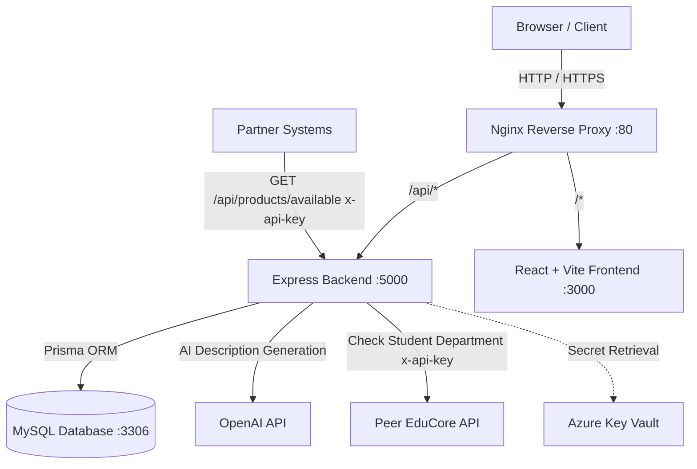

# 🛍️ Smart University Merchandise Store

[](https://www.docker.com/)
[](https://reactjs.org/)
[](https://nodejs.org/)
[](https://www.prisma.io/)
[](https://www.mysql.com/)
[](https://entra.microsoft.com/)
[](https://openai.com/)

**CSX4110 Backend Application Development • Section 541 (1/2026)**  
**Team Members:** Khine Khant (6611718), Siva Paoren (6630064), Thant Zin Oo (6722060)

---

## 📖 1. Project Overview

The **Smart University Merchandise Store** is a modern, web-based e-commerce platform allowing university staff and students to purchase and manage official university merchandise securely.

### Key Capabilities:
1. **Microsoft Entra ID (Azure AD) Authentication & RBAC**: Role-based access control for **Students**, **Staff**, and **Administrators**.
2. **AI Product Description Generation**: Integrated with **OpenAI GPT-4** to automatically write professional merchandise descriptions.
3. **Peer API Integration**:
   - **Consuming Peer API**: Communicates with the partner team's **EduCore Course Registration API** (`GET /students/{studentId}/department`) to verify student department enrollment for student discounts.
   - **Exposing Partner API**: Exposes `GET /api/products/available` protected with `x-api-key` for partner university services.
4. **Cloud & Container Ready**: Automated containerization with **Docker Compose**, **Nginx Reverse Proxy**, and **Azure Key Vault** secret management.

---

## 🏗️ 2. System Architecture



---

## 📁 3. Directory Structure

```text
university-merchandise-store/
├── docker-compose.yml          # Multi-container orchestration (MySQL, Backend, Frontend, Nginx)
├── nginx.conf                  # Nginx reverse proxy configuration
├── .env.example                # Unified environment variable template
├── README.md                   # Project documentation
│
├── backend/                    # Node.js + Express + TypeScript + Prisma
│   ├── prisma/
│   │   ├── schema.prisma       # Database schema definition (ERD)
│   │   └── seed.ts             # Default roles, users, categories & sample products
│   ├── src/
│   │   ├── config/             # DB & Azure Key Vault configuration
│   │   ├── controllers/        # Auth, Product, Cart, Order, User, Peer controllers
│   │   ├── middlewares/        # JWT auth, RBAC, API Key check, Error handler
│   │   ├── routes/             # Express API routing
│   │   ├── services/           # OpenAI AI service & EduCore Peer API client
│   │   ├── app.ts              # Express application configuration
│   │   └── server.ts           # Server bootstrap
│   ├── Dockerfile
│   ├── package.json
│   └── tsconfig.json
│
└── frontend/                   # React + TypeScript + Vite
    ├── src/
    │   ├── components/         # Navbar, ProductCard, CartDrawer
    │   ├── contexts/           # AuthContext (Entra ID / Dev Switcher), CartContext
    │   ├── pages/              # HomePage, ProductDetailPage, OrdersPage, AdminDashboard, LoginPage
    │   ├── services/           # Axios API client
    │   ├── types/              # TypeScript data interfaces
    │   ├── App.tsx             # Root application
    │   ├── index.css           # Modern design system & responsive styling
    │   └── main.tsx
    ├── Dockerfile
    ├── package.json
    └── vite.config.ts
```

---

## 🚀 4. Quickstart with Docker Compose (Recommended)

### Step 1: Clone and Configure Environment

```bash
cp .env.example .env
```

### Step 2: Build & Start All Containers

```bash
docker compose up --build
```

Docker Compose will start:
- 🌐 **Frontend (Nginx / Web)**: [http://localhost](http://localhost) (or [http://localhost:3000](http://localhost:3000))
- ⚡ **Backend API**: [http://localhost:5000/api](http://localhost:5000/api)
- 🗄️ **MySQL Database**: `localhost:3306`

> **Note:** The backend automatically applies the Prisma schema on container startup. In production it bootstraps only the required Admin, Staff, and Student roles, then runs the compiled server. Demo users/products and the development watcher run only when `NODE_ENV` is not `production`.

---

## 💻 5. Local Development (Without Docker)

### Prerequisites:
- Node.js >= 22.x
- MySQL 8.0 running locally

### 1. Setup Backend

```bash
cd backend
cp .env.example .env
npm install

# Initialize Prisma & Seed Database
npx prisma db push
npx prisma db seed

# Run Backend Dev Server
npm run dev
```

### 2. Setup Frontend

```bash
cd frontend
cp .env.example .env
npm install

# Run Vite Dev Server
npm run dev
```

---

## 👥 6. Pre-Configured Seed Users & Roles

The seed script creates default test accounts with instant role switching available via the UI navigation dropdown:

| Role | Name | Email | Department | Permissions |
| :--- | :--- | :--- | :--- | :--- |
| **Admin** | System Admin | `admin@university.edu` | IT Services | Full control: Users, Roles, Products, Orders, Reports |
| **Staff** | Store Staff Member | `staff@university.edu` | Bookstore & Merch | Create/Edit/Delete products, AI copy generation, Order status update |
| **Student** | Khine Khant | `khine.k@student.university.edu` | Computer Science | Browse merchandise, Add to cart, 20% CS jacket discount, View orders |
| **Student** | Siva Paoren | `siva.p@student.university.edu` | Computer Science | Browse merchandise, CS discount eligible |
| **Student** | Thant Zin Oo | `thant.z@student.university.edu` | Business Admin | Browse merchandise, standard student ordering |

### Configuring Real Microsoft Entra ID Login

The login flow uses MSAL (Authorization Code + PKCE) on the frontend and verifies the returned
ID token on the backend (signature via the tenant JWKS, issuer, audience, expiry). Until an
app registration is configured, the store runs in **dev fallback mode** (unverified profile
login + role switcher); once configured, only verified Entra ID tokens are accepted and the dev role switcher is disabled.

1. In [Microsoft Entra admin center](https://entra.microsoft.com), register an app:
   - **Platform**: Single-page application (SPA)
   - **Redirect URIs**: `http://localhost:5173` (Vite dev), `http://localhost` (Docker/nginx)
   - **Supported account types**: Single tenant (university directory)
   - **API permissions**: `User.Read` (delegated, Microsoft Graph) — no client secret needed for login
2. Fill in `AZURE_TENANT_ID` and `AZURE_CLIENT_ID` in `.env` / `backend/.env` / `frontend/.env`.
3. Set `ADMIN_EMAILS` (comma-separated) — those accounts get the **Admin** role automatically on
   first verified login. Staff/Student roles are managed afterwards via Admin → User Management.
4. Restart the containers (`docker compose up --build`). The login modal now shows **Sign in with Microsoft**.

**How it works:** the frontend opens the Microsoft sign-in popup and posts the resulting ID token
to `POST /api/auth/microsoft`; the backend validates it against the tenant's public keys, upserts
the user, and issues the app's own JWT used by all subsequent API calls.

**New production database:** container startup creates only the three required RBAC roles. Put at
least one university account in `ADMIN_EMAILS` before deployment. That account becomes the initial
administrator on its first Microsoft login; other accounts are created as Students and can then be
promoted to Staff from Admin → User Management.

---

## 🤖 7. AI Product Description Integration

Staff and Administrators can trigger the **OpenAI GPT-4** integration when creating or updating products:

An administrator configures the provider URL, model, and API key under **Admin Dashboard →
Site Settings**. The API key is stored only in the database and is never loaded from an
environment variable or Azure Key Vault.

```http
POST /api/products/ai-description
Authorization: Bearer <STAFF_OR_ADMIN_JWT>
Content-Type: application/json

{
  "productName": "University Varsity Bomber Jacket",
  "categoryName": "Apparel & Clothing",
  "department": "Computer Science"
}
```

**Response:**
```json
{
  "description": "Exclusive Computer Science Department premium bomber jacket with cyber-blue trim, custom embroidered CS patch, and water-resistant outer shell. Designed for campus comfort and academic pride."
}
```

---

## 🔗 8. Peer API Specifications

### A. Consuming Peer API (EduCore Course Registration)
When a student checks out department-specific merchandise (e.g., Computer Science Jacket), our backend sends a request to the EduCore API:
- **Endpoint**: `GET /students/{studentId}/department`
- **Header**: `x-api-key: <PEER_EDUCORE_API_KEY>`

### B. Exposed Partner API (`GET /api/products/available`)
Partner university systems can query live store stock:
- **Endpoint**: `GET http://localhost:5000/api/products/available`
- **Header**: `x-api-key: partner_incoming_api_key_98765`

**Example Response:**
```json
[
  {
    "id": 1,
    "name": "Signature University Hoodie",
    "stock": 45,
    "price": 790
  },
  {
    "id": 2,
    "name": "Computer Science Department Varsity Jacket",
    "stock": 25,
    "price": 1290,
    "department": "Computer Science",
    "discountPct": 20
  }
]
```

---

## ☁️ 9. Azure Cloud Deployment Guide

### Azure Key Vault setup

The backend uses `DefaultAzureCredential` with the service-principal values supplied for
the class project. That identity only needs permission to read secrets.

1. Create a resource group and RBAC-enabled vault (replace the example values):

   ```bash
   az group create --name merch-store-rg --location southeastasia
   az keyvault create \
     --name <globally-unique-vault-name> \
     --resource-group merch-store-rg \
     --location southeastasia \
     --enable-rbac-authorization true
   ```

2. Add the application secrets. Key Vault secret names use hyphens because Azure secret
   names cannot contain underscores:

   ```bash
   az keyvault secret set --vault-name <vault-name> --name JWT-SECRET --value '<at-least-32-random-characters>'
   az keyvault secret set --vault-name <vault-name> --name PEER-EDUCORE-API-KEY --value '<outgoing-peer-api-key>'
   az keyvault secret set --vault-name <vault-name> --name PARTNER-EXPOSED-API-KEY --value '<incoming-partner-api-key>'
   ```

   | Key Vault secret | Backend setting |
   | :--- | :--- |
   | `JWT-SECRET` | `JWT_SECRET` |
   | `PEER-EDUCORE-API-KEY` | `PEER_EDUCORE_API_KEY` |
   | `PARTNER-EXPOSED-API-KEY` | `PARTNER_EXPOSED_API_KEY` |

3. Give the service principal the **Key Vault Secrets User** role at the vault scope if
   it has not already been granted access:

   ```bash
   az role assignment create \
     --assignee <AZURE_CLIENT_ID> \
     --role "Key Vault Secrets User" \
     --scope <key-vault-resource-id>
   ```

4. Configure the backend with the four supplied values:

   ```dotenv
   AZURE_TENANT_ID=<tenant-id>
   AZURE_CLIENT_ID=<service-principal-client-id>
   AZURE_CLIENT_SECRET=<service-principal-secret>
   KEY_VAULT_URL=https://<vault-name>.vault.azure.net
   ```

At startup, values found in Key Vault override local environment values. Missing optional
vault entries keep their environment fallbacks. If a configured vault cannot be reached or
authenticated in production, startup stops instead of silently using fallback credentials.

### Deploy on an Azure VM

1. **Provision an Azure Linux VM**.
2. **Install Docker Engine and the Docker Compose plugin** by following Docker's
   [Ubuntu installation guide](https://docs.docker.com/engine/install/ubuntu/). Compose
   v2.24 or newer is required by the production overlay.
3. **Clone the application**:
   ```bash
   git clone <REPO_URL>
   cd university-merchandise-store
   cp .env.example .env
   ```
4. **Configure production environment values**. In particular, set the public HTTPS
   origins used by CORS and Microsoft Entra ID:

   ```dotenv
   NODE_ENV=production
   CORS_ORIGINS=https://store.example.edu
   VITE_AZURE_REDIRECT_URI=https://store.example.edu
   CERTBOT_DOMAIN=store.example.edu
   CERTBOT_EMAIL=admin@example.edu
   ```

   Add the same HTTPS redirect URI to the Microsoft Entra app registration. Point the
   domain's DNS record to the VM and allow inbound TCP ports 80 and 443 in its network
   security group.

5. **Issue the first certificate and start production HTTPS**:

   ```bash
   ./scripts/init-letsencrypt.sh
   ```

   The script safely reads `CERTBOT_DOMAIN` and `CERTBOT_EMAIL` from `.env`; it does
   not evaluate the environment file as a shell script.

   The production overlay keeps MySQL, the backend, and the frontend off public host
   ports. Certbot checks for renewal every 12 hours, and Nginx reloads periodically to
   pick up a renewed certificate. Port 80 remains open only for Let's Encrypt HTTP-01
   validation and redirects normal requests to HTTPS.

   Subsequent deployments do not need the bootstrap script:

   ```bash
   docker compose -f docker-compose.yml -f docker-compose.prod.yml up -d --build
   ```

   Local development is unchanged and does not run Certbot:

   ```bash
   docker compose up --build
   ```

Azure's JavaScript guidance recommends managed identity in hosted environments and
`DefaultAzureCredential` for a consistent development/production authentication flow. See
the [Azure Key Vault JavaScript quickstart](https://learn.microsoft.com/en-us/azure/key-vault/secrets/quick-create-node)
and [Azure Identity authentication guidance](https://learn.microsoft.com/en-us/azure/developer/javascript/sdk/authentication/best-practices).
